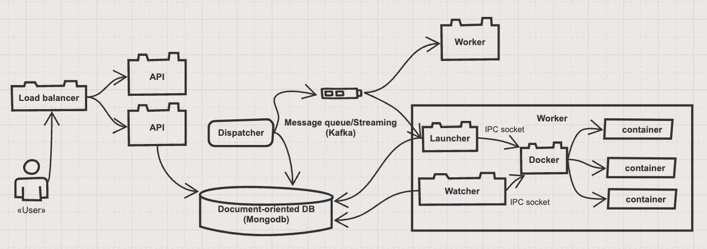

# code execution engine

Simple remote code execution web service.
It's designed with scalability and reliability in mind, and can be extended to support any number of programming languages.
Currently, only C# support is implemented.

Prerequisites:
* JVM
* Docker

## Run application

* `./run-infra.sh` - set up all required infrastructure (mongodb, kafka)
* `./gradlew :dispatcher:run` - run dispatcher instance
* `./gradlew :worker:run` - run worker instance
* `./gradlew :api:run` - run api instance

## Description

The main functionality is implemented, but there is room for improvement though:
* one
* two